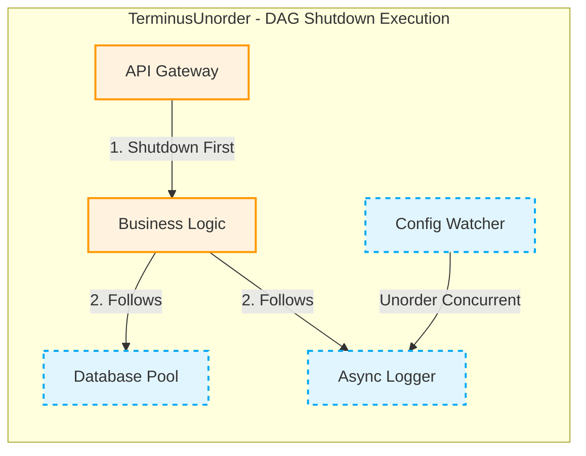

# 🛑 TerminusUnorder


**TerminusUnorder** 是一个基于现代 C++ (C++17) 的轻量级、**Header-only** 的优雅退出协调器 (Graceful Shutdown Coordinator) 框架。

在复杂的 C++ 后端服务、工业控制或底层保护系统中，进程退出时经常面临组件析构顺序错乱、局部静态变量提前销毁导致的 Core Dump，甚至因为第三方库死锁导致进程僵死。TerminusUnorder 通过引入 **DAG（有向无环图）拓扑排序** 和 **Unorder 并发收割** 机制，彻底解决复杂生命周期管理的痛点，让系统“尽最大努力优雅，最后果断安全地退出”。

## ✨ 核心特性

* 🔗 **DAG 依赖驱动 (Topology Order)：** 严格保证退出顺序。如果组件 A 依赖组件 B，框架会确保 A 完全退出后，再触发 B 的清理逻辑。
* ⚡ **Unorder 无序并发 (Concurrent Harvest)：** 同一拓扑层级（互不依赖）的节点，将被分配到内部线程池进行并发清理，极大缩短系统整体退出时间。
* 🛡️ **超时逃逸机制 (Timeout Escape Hatch)：** 每个节点均可配置最大等待时间。若某节点发生死锁或超时，框架会通过底层的 Detach 机制果断切断该节点，保证后续节点的安全清理，防止整个进程僵死。
* 📦 **极简集成 (Header-Only)：** 无需繁琐的编译依赖，单头文件直接引入，支持 Lambda 闭包快速注册。

## 📐 架构与执行流程

框架接收到退出信号后，会将组件反向排序，按层级进行并发收割。



## 🚀 快速开始

### 1. 引入框架

将 `include/terminus_unorder` 放入你的工程中，或通过 CMake FetchContent 引入。

```cpp
#include "terminus_unorder/coordinator.hpp"
#include <iostream>
#include <chrono>

using namespace terminus;

int main() {
    UnorderCoordinator engine;

    // 1. 使用 Lambda 快速注册节点
    auto dbNode = std::make_shared<FunctionalNode>(
        "Database", 
        []() { std::cout << "Closing DB...\n"; return true; }
    );
    
    // 设置一个带有超时控制的恶意死锁节点
    auto logicNode = std::make_shared<FunctionalNode>(
        "Logic", 
        []() { 
            std::this_thread::sleep_for(std::chrono::seconds(10)); 
            return true; 
        },
        std::chrono::milliseconds(500) // 500ms 超时强杀
    );

    // 2. 构建依赖 (Logic 必须在 Database 之前退出)
    engine.Register(dbNode, {});
    engine.Register(logicNode, {"Database"});

    // 3. 执行优雅退出
    std::cout << "Triggering Shutdown...\n";
    engine.ShutdownAll();

    return 0;
}

```

## 🛠️ 构建与安装

本库依赖 CMake (>= 3.14) 和支持 C++17 的编译器（GCC, Clang, MSVC）。

### 集成到已有 CMake 项目

```cmake
include(FetchContent)
FetchContent_Declare(
    terminus_unorder
    GIT_REPOSITORY [https://github.com/your-username/TerminusUnorder.git](https://github.com/your-username/TerminusUnorder.git)
    GIT_TAG main
)
FetchContent_MakeAvailable(terminus_unorder)

add_executable(my_app main.cpp)
target_link_libraries(my_app PRIVATE terminus_unorder)

```

### 本地编译示例与测试

项目内置了丰富的 Examples 和基于 Google Test 的并发单元测试（支持 TSan 数据竞争检测）。

```bash
git clone [https://github.com/your-username/TerminusUnorder.git](https://github.com/your-username/TerminusUnorder.git)
cd TerminusUnorder

# 配置构建 (启用测试与示例)
cmake -S . -B build -DCMAKE_BUILD_TYPE=Debug -DTERMINUS_BUILD_TESTS=ON -DTERMINUS_BUILD_EXAMPLES=ON

# 编译所有目标
cmake --build build

# 运行单元测试
cd build && ctest -V

```

### 全局安装与卸载 (Linux/macOS)

```bash
# 安装头文件到系统目录 (/usr/local/include)
sudo cmake --build build --target install
```

## 🤝 贡献指南

欢迎提交 Issue 和 Pull Request！
在提交代码前，请确保所有的单元测试均已通过，并在新增功能时补充相应的测试用例。

## 📄 许可证

本项目采用 [MIT License](https://www.google.com/search?q=LICENSE) 开源协议。
